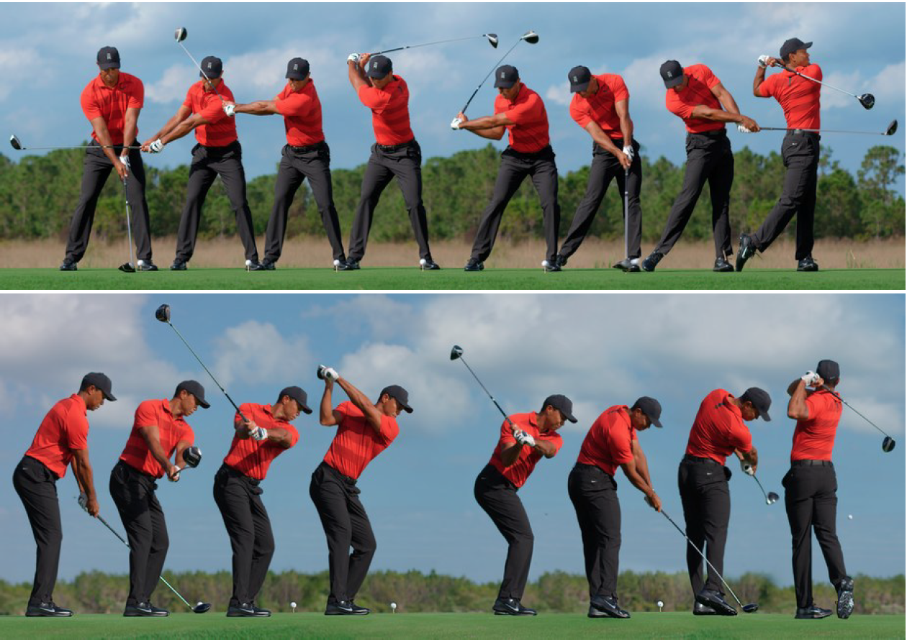
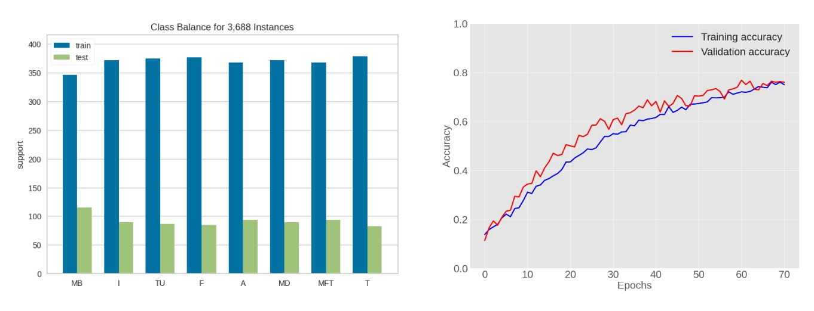
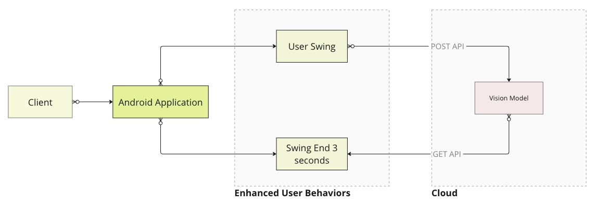
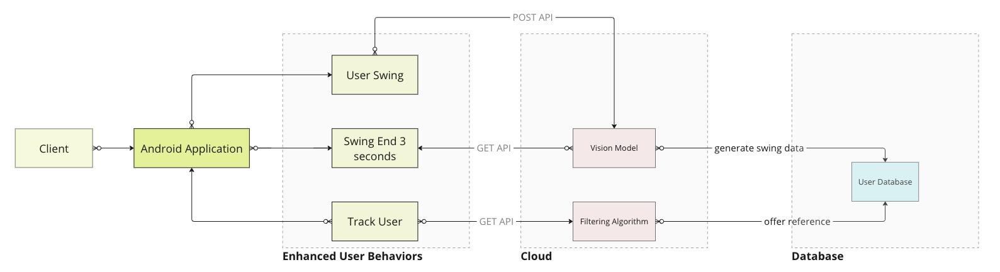

# Swing Coach

Swing Coach is an XR golf training application for Meta Quest 3 that helps players visualize an ideal swing plane, compare it against their own swing, and receive an objective score and feedback. A complementary machine learning pipeline (in progress) uses video-based computer vision to analyze swing phases and compare player performance against professional golfers.

---

## Table of Contents

- [Project Description](#project-description)
- [Key Features](#key-features)
- [XR / Unity Application](#xr--unity-application)
- [Ergonomics & Biomechanics](#ergonomics--biomechanics)
- [Machine Learning Module](#machine-learning-module)
  - [Goals](#goals)
  - [Workflow](#workflow)
  - [Model Performance](#model-performance)
  - [Running the ML Notebook](#running-the-ml-notebook)
- [Tech Stack](#tech-stack)
  - [Current Stack](#current-stack)
  - [Planned Stack](#planned-stack)
- [Roadmap](#roadmap)
- [References](#references)

---

## Project Description

**Tags:** `Golf` `XR/AR` `Computer Vision` `Machine Learning`  

Swing Coach addresses a common challenge in golf practice: the gap between how a swing **feels** and how it **actually looks** in space.

Traditional methods such as:
- 2D video recordings, or  
- occasional sessions with a golf coach  

have several limitations: limited viewpoints, lack of real-time guidance, high cost, and difficulty understanding 3D motion from 2D footage.

Swing Coach provides:

- A **Quest 3 XR/AR application** that draws an ideal swing plane directly in the player’s field of view and tracks the controller/club motion relative to that plane.
- A **Machine Learning pipeline (future integration)** that analyzes recorded swings using a vision model trained on professional golfers.

The long-term goal is to offer golfers an accessible, always-available tool to self-diagnose swing issues and track progress over time, without relying on expensive hardware or frequent in-person coaching.

---

## Key Features

### XR / Unity Application (Current)

- Visualize an **ideal swing plane** inside the headset.
- Track the **controller/club trajectory** while the golfer swings.
- Compare **real vs ideal swing path**.
- Compute a simple **swing score** (0–100), where 100 indicates near-perfect alignment with the target plane.

### Planned Enhancements (XR)

- **Controller / Club Rotation**
  - Visualize ideal vs actual club/controller rotation along the swing path.
- **Head Movement Tracking**
  - Highlight ideal head movement and rotation vs actual motion to reduce excessive sway or early extension.
- **Progression & History**
  - View previous swings and progression over time.
- **Detailed Diagnostics**
  - Break down the swing into phases (backswing, downswing, follow-through) and highlight which phase needs the most correction.
- **Leaderboards / Social**
  - High scores and friendly competition with friends or other players.

---

## XR / Unity Application

The current Unity application targets **Meta Quest 3** (Android-based XR) and focuses on:

- Rendering a clean, ideal swing curve in 3D space.
- Letting the player align their real swing with this reference in real time.
- Providing immediate visual feedback on whether the swing is “on plane” or deviating.

At this stage, the Unity application is **not yet connected** to the ML algorithm. It functions as a standalone XR training tool.

---

## Ergonomics & Biomechanics

  

The image above illustrates the biomechanical progression of a golf swing.

We follow the standard eight-event model used in the **GolfDB** work:

1. **Address (A)** – Just before takeaway begins.  
2. **Toe-up (TU)** – Shaft parallel with the ground during the backswing.  
3. **Mid-backswing (MB)** – Lead arm parallel with the ground during the backswing.  
4. **Top (T)** – Moment the club changes direction from backswing to downswing.  
5. **Mid-downswing (MD)** – Lead arm parallel with the ground during the downswing.  
6. **Impact (I)** – Clubhead makes contact with the ball.  
7. **Mid-follow-through (MFT)** – Shaft parallel with the ground during follow-through.  
8. **Finish (F)** – Just before the golfer relaxes from the final pose.

The planned ML pipeline uses these events to:

- Segment swing videos,
- Compare an XR player’s motion to professional benchmarks,
- Provide phase-specific feedback.

---

## Machine Learning Module

The machine learning component is based on:

- **GolfDB: A Video Database for Golf Swing Sequencing**  
  Paper: https://arxiv.org/abs/1903.06528  
- An associated dataset of ~1400 videos of professional golfers.

A convolutional neural network (CNN) (from GolfDB) is used to detect swing events and extract motion features from pro swings.

### Goals

1. **Train Vision Model**
   - Learn common motion patterns of professional golfers.
   - Capture rich temporal and spatial features of elite swings.

2. **Test Vision Model**
   - Predict the eight phases of a golf swing on unseen data.

3. **Apply Vision Model**
   - Analyze an XR player’s swing frame-by-frame.
   - Predict the swing phase of each frame.

4. **Data Analysis & Feedback**
   - **Swing comparison**: quantify differences between the XR player and pros across phases.
   - **Player tracking**: monitor distribution and growth of player performance over time.

### Workflow

High-level procedure for the ML pipeline:

1. **Data Collection**
   - Download the video dataset (e.g., from Kaggle or the provided Google Drive link).
2. **Pre-processing**
   - Normalize video dimensions and formats.
   - Standardize frame rates.
3. **Data Cleaning**
   - Remove corrupted or low-quality samples.
4. **Feature Engineering**
   - Extract relevant features (frames, motion cues, etc.).
5. **Model Training**
   - Train the CNN using ~75% of the dataset.
6. **Model Evaluation**
   - Test on the remaining 25% of the data.
7. **Model Analysis**
   - Visualize training/validation curves and event localization performance.
8. **User Swing Analysis**
   - Apply the model to a user’s swing video to obtain phase predictions and comparisons vs pro swings.

### Model Performance

  

The above plots (training, testing, validation) summarize the vision model’s performance on the GolfDB-based dataset.

---

### Running the ML Notebook

The prototype algorithm is distributed as a Jupyter notebook (`.ipynb`) intended to be run in **Google Colab**.

**Requirements**

- Google Colab (recommended) or local Jupyter environment  
- Python environment with:
  - `numpy`
  - `pandas`
  - `scikit-learn`
  - `pytorch`
  - other standard scientific Python libraries as used in the notebook

**Steps**

1. Download the compressed dataset (e.g., `videos_160.zip`) from the provided link.
2. Download the algorithm notebook (`.ipynb`) from the `Algorithm` folder.
3. Download all required files from the `data` folder.
4. Open the `.ipynb` file in **Google Colab**.
5. Install required dependencies in the Colab environment (as specified in the notebook).
6. Upload:
   - Your golf swing video, and  
   - The downloaded data files  
   to the `sample_data` folder in the Colab environment.
7. In the notebook, **replace the test video path** with the path of your uploaded swing video.
8. Run all cells top to bottom.
   - If any optional modules fail due to deprecation or version issues, they can be skipped unless they are critical for your use case.

---

## Tech Stack

### Current Stack

**XR / Unity (Quest 3)**

- Unity (Android / XR build)
- Meta Quest 3 as target device
- XR/AR interaction and visualization
- Local-only experience (no live connection to ML or backend yet)

The current build focuses on:
- Displaying the ideal swing plane
- Tracking controller/club movement
- Showing a basic swing score

  

### Planned Stack

A mature version of Swing Coach will integrate:

- **User Experience**
  - Polished XR UX for swing training and feedback.
- **Mobile / XR Application**
  - Unity app for Quest 3 and possibly companion mobile apps.
- **Algorithm Cloud Deployment**
  - Vision/Machine Learning service deployed in the cloud.
  - REST API for:
    - Uploading swing videos or motion data
    - Retrieving analysis results and scores
- **Database Layer**
  - Per-user storage of:
    - Swing sessions
    - Scores and metrics
    - Longitudinal progress and history

  

---

## Roadmap

Planned next steps:

1. **Integrate ML with XR App**
   - Export swing motion or video from Quest.
   - Call cloud-based vision model via REST API.
   - Show phase detection and detailed metrics in-headset.

2. **Advanced Metrics**
   - Detect:
     - Over-the-top moves
     - Early extension
     - Excessive sway/slide
     - Poor head stability
   - Provide phase-specific guidance.

3. **Scoring & Leaderboards**
   - Robust scoring model combining multiple metrics.
   - Local and online leaderboards.

4. **User Accounts & History**
   - Persistent user profiles.
   - Session history, trend charts, and progression analytics.

5. **Coach / Pro Mode**
   - Allow coaches to review players’ swings remotely.
   - Overlay pro swing templates and advanced analytics.

---

## References

- **GolfDB: A Video Database for Golf Swing Sequencing**  
  Paper: https://arxiv.org/abs/1903.06528  
- GolfDB GitHub Repository: https://github.com/wmcnally/golfdb  

Additional implementation details, datasets, and scripts are referenced directly in this repository’s `Algorithm` and `data` folders.
